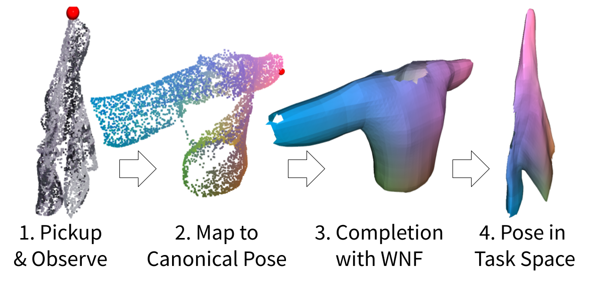

# GarmentNets

This repository contains the source code for the paper [GarmentNets:
Category-Level Pose Estimation for Garments via Canonical Space Shape Completion](https://garmentnets.cs.columbia.edu/). This paper has been accepted to ICCV 2021.



## Cite this work
```
@inproceedings{chi2021garmentnets,
  title={GarmentNets: Category-Level Pose Estimation for Garments via Canonical Space Shape Completion},
  author={Chi, Cheng and Song, Shuran},
  booktitle={The IEEE International Conference on Computer Vision (ICCV)},
  year={2021}
}
```

## Datasets
1. [GarmentNets Dataset](https://drive.google.com/file/d/10CU_YQa-6IjKkS6WkYhcL5RAnXS0TqSt/view?usp=sharing) (GarmentNets training and evaluation)

2. [GarmentNets Simulation Dataset](https://drive.google.com/file/d/1CHJnUUqhNMnpmnUJcDNj4xT61DQiZ2Zj/view?usp=sharing) (raw Blender simluation data to generate the GarmentNets Dataset)

3. [CLOTH3D Dataset](https://chalearnlap.cvc.uab.cat/dataset/38/description/) (cloth meshes in a canonical pose)

The GarmentNets Dataset contains point clouds before and after gripping simulation with point-to-point correspondance, as well as the winding number field ($128^3$ volume).

The GarmentNets Simulation Dataset contains the raw vertecies, RGBD images and per-pixel UV from Blender simulation and rendering of CLOTH3D dataset. Each cloth instance in CLOTH3D is simulated 21 times with different random gripping points.

Both datasets are stored using [Zarr](https://zarr.readthedocs.io/en/stable/) format.

## 🆕 Sample Datasets
Upon popular demand, we added a small subset of our datasets, which contains 25 instances of the `Tshirt` category. We are also working on alternative ways to host the complete datasets for reserchers outside of the United States.
1. [GarmentNets Dataset Sample](https://garmentnets.cs.columbia.edu/dataset/garmentnets_dataset_sample.zarr.tar.gz)

2. [GarmentNets Simulation Dataset Sample](https://garmentnets.cs.columbia.edu/dataset/garmentnets_simulation_dataset_sample.zarr.tar.gz)


## Pretrained Models
[GarmentNets Pretrained Models](https://drive.google.com/file/d/1PTuizGDgJA52OfM4BKwL_Eu93chTSRz8/view?usp=sharing)

GarmentNets are trained in 2 stages:
1. PointNet++ canoninicalization network
2. Winding number field and warp field prediction network

The checkpoints for 2 stages x 6 categories (12 in total) are all included. For evaluation, the checkpoints in the `garmentnets_checkpoints/pipeline_checkpoints` directory should be used.

## Usage
### Installation
A conda [environment.yml](./environment.yml) for `python=3.9, pytorch=1.9.0, cudatoolkit=11.1` is provided.
```
conda env create --file environment.yml
```

Alternatively, you can directly executive following commands:
```
conda install pytorch torchvision cudatoolkit=11.1 pytorch-geometric pytorch-scatter wandb pytorch-lightning igl hydra-core scipy scikit-image matplotlib zarr numcodecs tqdm dask numba -c pytorch -c nvidia -c rusty1s -c conda-forge

pip install potpourri3d==0.0.4
```

### Evaluation
Assuming the project directory is `~/dev/garmentnets`.
Assuming the [GarmentNets Dataset](https://drive.google.com/file/d/10CU_YQa-6IjKkS6WkYhcL5RAnXS0TqSt/view?usp=sharing) has been extracted to `<PROJECT_ROOT>/data/garmentnets_dataset.zarr` and [GarmentNets Pretrained Models](https://drive.google.com/file/d/1PTuizGDgJA52OfM4BKwL_Eu93chTSRz8/view?usp=sharing) has been extracted to `<PROJECT_ROOT>/data/garmentnets_checkpoints`.

Generate prediction Zarr with
```
(garmentnets)$ python predict.py datamodule.zarr_path=<PROJECT_ROOT>/data/garmentnets_dataset.zarr/Dress main.checkpoint_path=<PROJECT_ROOT>/data/garmentnets_checkpoints/pipeline_checkpoints/Dress_pipeline.ckpt
```
Note that the dataset `zarr_path` and `checkpoitn_path` must belong to the same category (`Dress` in this case).

[Hydra](https://hydra.cc/) should automatically create a run directory such as `<PROJECT_ROOT>/outputs/2021-07-31/01-43-33`. To generate evaluation metrics, execute:
```
(garmentnets)$ python eval.py main.prediction_output_dir=<PROJECT_ROOT>/outputs/2021-07-31/01-43-33
```
The `all_metrics_agg.csv` and `summary.json` should show up in the [Hydra](https://hydra.cc/) generated directory for this run.

### Training
As mentioned above, GarmentNets are trained in 2 stages. Using a single Nvidia RTX 2080Ti, training stage 1 will take roughly a week and training stage 2 can usually be done overnight.

To retrain stage 2 with a pre-trained stage 1 checkpoint:
```
(garmentnets)$ python train_pipeline.py datamodule.zarr_path=<PROJECT_ROOT>/data/garmentnets_dataset.zarr pointnet2_model.checkpoint_path=<PROJECT_ROOT>/data/garmentnets_checkpoints/pointnet2_checkpoints/Dress_pointnet2.ckpt
```

To train stage 1 from scratch:
```
(garmentnets)$ python train_pointnet2.py datamodule.zarr_path=<PROJECT_ROOT>/data/garmentnets_dataset.zarr
```
